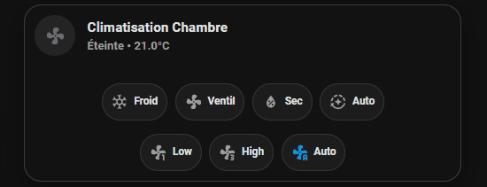

### *Advanced Glassmorphism & SVG-Driven Interface*

Cette interface haut de gamme pour déshumidificateurs Midea (et compatibles) transcende les limites standards de Home Assistant. Elle repose sur une architecture **monocoque** pour offrir une expérience utilisateur fluide, réactive et une esthétique moderne.

## 💎 Points Forts (Value Proposition)

* **Design Glassmorphism :** Effet de transparence et dégradés dynamiques basés sur l'état de l'entité.
* **Architecture Monolithique :** Suppression des bordures disgracieuses entre les contrôles et la carte principale pour un rendu "unifié".
* **Ingénierie SVG :** Animation de rotation réelle de l'icône ventilateur avec un centre de rotation stabilisé.
* **UX Contextuelle :** Adaptation visuelle (couleur du liseré et intensité du fond) selon le mode actif (*Auto*, *Manual*, *Clothes-Dry*).
* **Cockpit Tout-en-un :** Centralisation des modes et des vitesses de ventilation sur un seul bloc compact.

---

## 🛠️ Prérequis Technologiques (HACS)

La mise en œuvre de cette interface repose sur des outils avancés de personnalisation du DOM de Home Assistant. Vous devez impérativement installer les composants suivants via **HACS** :

### 1. Mushroom Cards
La base esthétique de l'interface.
* **Repository :** [piitaya/lovelace-mushroom](https://github.com/piitaya/lovelace-mushroom)

### 2. Card-Mod
L'outil indispensable pour l'injection de CSS et la gestion des animations.
* **Repository :** [thomasloven/lovelace-card-mod](https://github.com/thomasloven/lovelace-card-mod)

### 3. Mod-Card
Bien que faisant partie de la suite `card-mod`, la fonctionnalité `mod-card` est cruciale ici. Elle permet d'appliquer des styles CSS à des cartes qui n'en acceptent normalement pas (comme les `vertical-stack`), permettant ainsi de créer le châssis monocoque du projet.
* **Repository :** [Card-mod / Mod-card feature](https://github.com/thomasloven/lovelace-card-mod#mod-card)

---

## 🚀 Installation rapide

1. Installez les dépendances HACS.
2. Redémarrez Home Assistant.
3. Importez `lovelace/dehumidifier_tile.yaml` dans votre dashboard.
4. Adaptez les entités à votre configuration (`humidifier.deshumidificateur`, etc.).

👉 Pour une procédure détaillée et le dépannage, consultez :
- [Installation détaillée](./docs/installation.md)
- [Configuration](./docs/configuration.md)
- [FAQ](./docs/faq.md)
- [Dépannage](./docs/troubleshooting.md)

---

## 🤝 Contributions
Les pull requests sont les bienvenues. Pour les changements majeurs, veuillez d'abord ouvrir une issue pour discuter de vos propositions.

**License :** [MIT](https://choosealicense.com/licenses/mit/)
